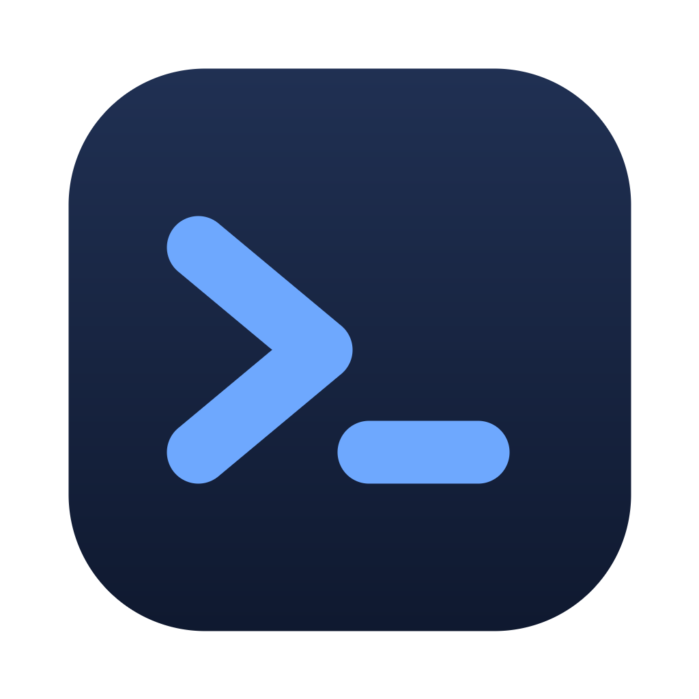

# Houston

An open-source, local-first **coding agent for macOS**, in the spirit of Claude Code
and Codex — but **bring your own model**. Point it at Claude, GPT, Gemini, any
OpenAI-compatible API, or a local model (Ollama / LM Studio), give it a project
folder, and let it read, edit, search, and run code — every action gated by an
approval flow and confined to a macOS sandbox.

Built with Electron + React + TypeScript. Apple Silicon (arm64).



## Features

- **Any model, your keys.** Anthropic (Claude), OpenAI (GPT), Google (Gemini),
  any OpenAI-compatible endpoint, and local models via Ollama or LM Studio. Add
  custom endpoints and fetch live model lists in Settings.
- **Agentic tool use.** The agent can `read_file`, `write_file`, `edit_file`,
  `list_dir`, `glob`, `search_files`, `run_shell`, `web_fetch`, `web_search`, and
  `todo_write` to actually do the work — not just describe it.
- **Web search.** With a Tavily API key (set in Settings → *Web search*), the
  agent can `web_search` the web for current information. Like `web_fetch`, it
  requires approval since it leaves the machine.
- **Task list.** For multi-step work the agent keeps a `todo_write` scratchpad,
  rendered live as a checklist in the transcript so you can see the plan and
  watch it tick off items.
- **Sandboxed execution.** Shell commands run under the macOS **Seatbelt**
  sandbox (`sandbox-exec`), confined to the project directory: writes outside the
  project and (by default) network access are blocked.
- **Background processes.** `run_shell` can start long-running commands (dev
  servers, watchers) in the background and return immediately; the agent polls
  them with `read_shell_output` and stops them with `kill_shell`. They're killed
  when the app quits.
- **Approval flow.** Choose how much autonomy to grant: *ask every time*,
  *auto-approve edits*, or *full auto*. Approve, deny, or allow-for-the-run on
  each tool call. File edits show an inline red/green **diff** so you can review
  exactly what changes before approving.
- **Secure key storage.** API keys are encrypted with the macOS Keychain
  (Electron `safeStorage`) and never leave the main process or touch the renderer.
- **Persistent conversations**, scoped per project folder.
- **Long sessions stay in budget.** When a conversation grows past a configurable
  token threshold, Houston automatically summarizes the older turns so it never
  overflows the model's context window. The full transcript stays on screen —
  only what's sent to the model is compacted. Tune or disable the threshold in
  Settings → *Context window*.
- **Project-aware.** If your project has an `AGENTS.md` or `CLAUDE.md` at its root,
  Houston loads it into the system prompt so the agent follows your conventions,
  build/test commands, and house rules without you re-explaining them each time.

## Install (prebuilt DMG)

Download `Houston-<version>-arm64.dmg`, open it, and drag **Houston** to
Applications.

> **The build is unsigned** (no Apple Developer ID). The first time you open it,
> macOS Gatekeeper will warn you. Either:
> - Right-click the app → **Open** → **Open**, or
> - Remove the quarantine attribute:
>   ```bash
>   xattr -dr com.apple.quarantine "/Applications/Houston.app"
>   ```
>
> To ship a signed + notarized build, see [Signing & notarization](#signing--notarization).

## First run

1. Open **Settings** (sidebar) and set an API key for at least one provider
   (or point a local endpoint at Ollama/LM Studio — no key needed).
2. Pick a **project folder** (top bar).
3. Choose a **model** and an **approval policy**.
4. Ask it to build or change something.

## Develop

```bash
npm install
npm run dev      # hot-reloading dev build
```

Useful scripts:

```bash
npm run build    # typecheck + bundle to out/
npm test         # unit tests (vitest)
npm run icon     # regenerate the app icon (build/icon.png + icon.icns)
```

## Build a DMG

```bash
npm run dist     # → release/Houston-<version>-arm64.dmg
```

Every PR set to auto-merge also builds the `.app` + `.dmg` in CI (on a macOS
runner, against the merged state) and uploads them as a `houston-mac-arm64`
artifact on the workflow run — grab a build from the **Actions** tab without
building locally.

## Updates

Packaged builds check for updates on launch via `electron-updater`, against the
GitHub Releases feed configured in [`electron-builder.yml`](electron-builder.yml)
(`publish:`), and log when a newer version is available. (No-op in dev; set
`HOUSTON_DISABLE_UPDATER=1` to turn it off.)

It does **not** auto-download or silently install: this build is unsigned, so
there's no Developer ID signature for `electron-updater` to verify against, and
silently installing remote packages would make the release pipeline an RCE
boundary. Grab the newer DMG from **Releases** manually. Once the app is
[signed + notarized](#signing--notarization), enable `autoDownload` /
`autoInstallOnAppQuit` in [`src/main/updater.ts`](src/main/updater.ts) so the
signature check is meaningful. Update metadata is published by running
`npm run dist` with a `GH_TOKEN` and `--publish`, or by attaching the DMG and the
generated `latest-mac.yml` to a release.

## Architecture

```
src/
├── shared/        types + IPC channel names shared by all processes
│   ├── agent.ts       chat/tool/stream protocol + agent run + conversation types
│   ├── types.ts       settings, providers, approval policy
│   └── defaults.ts    built-in provider seeds
├── main/          Electron main process (Node)
│   ├── providers/     Anthropic / OpenAI / Gemini / OpenAI-compatible adapters
│   ├── agent/         tool definitions + the tool-calling loop + system prompt
│   │                  (incl. compaction.ts — summarize old turns to fit context;
│   │                   rules.ts — load project AGENTS.md / CLAUDE.md)
│   ├── sandbox.ts     macOS Seatbelt profile + sandboxed command runner
│   ├── secrets.ts     Keychain-encrypted API-key storage
│   ├── store.ts       settings persistence
│   ├── conversations.ts  conversation persistence (one JSON per chat)
│   └── ipc.ts         all IPC handlers
├── preload/       contextBridge — the typed `window.api` surface
└── renderer/      React UI (transcript, model picker, settings, approvals)
```

The renderer talks to the main process only through the preload bridge. Provider
adapters translate a single internal chat/tool protocol to and from each SDK, so
the agent loop and UI never depend on a specific provider.

## Security model

- **Tool execution is sandboxed.** `run_shell` runs under `sandbox-exec` with a
  generated profile: deny-by-default, filesystem reads allowed, writes restricted
  to the project + temp dirs, network denied unless in *full auto*.
- **File tools are contained** to the workspace in code — any path that resolves
  outside the project root is rejected.
- **Human in the loop.** Writes and shell commands require approval unless you
  opt into a more autonomous policy. `web_fetch` network egress always prompts on
  first use — even in *full auto* — since it leaves the machine; choose
  *allow-for-the-run* to stop further prompts that run.
- **Keys at rest** are encrypted via the OS Keychain; only ciphertext is written
  to disk (`0600`), and the renderer only ever sees a `hasKey` flag.

Coding agents run model-authored commands. Treat *full auto* + network with the
same caution you'd treat running untrusted code, and prefer the default
*ask*/*auto-edit* policies.

## Signing & notarization

The build is ad-hoc signed because there's no Developer ID configured. To sign
and notarize, set `mac.identity` in [`electron-builder.yml`](electron-builder.yml)
to your Developer ID and add a notarization step (e.g. `@electron/notarize` via
an `afterSign` hook), then `npm run dist`.

## License

[MIT](./LICENSE)
